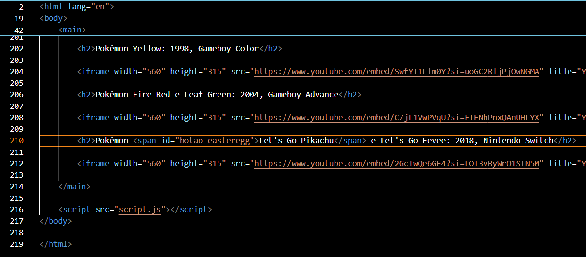
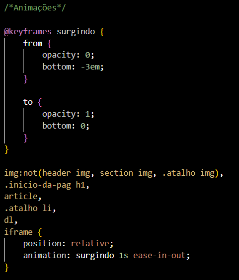
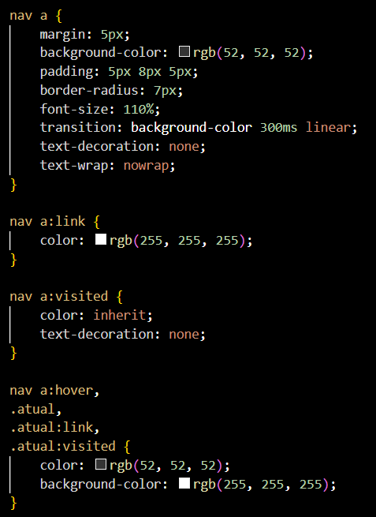
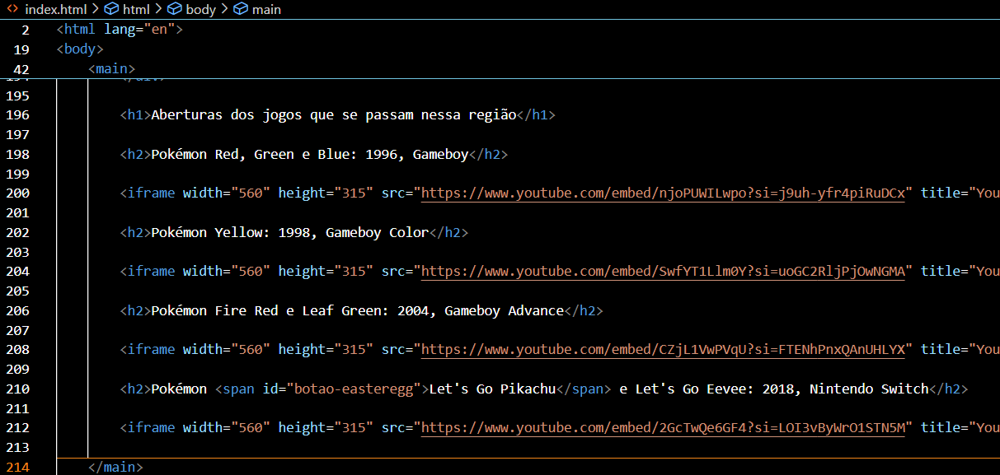
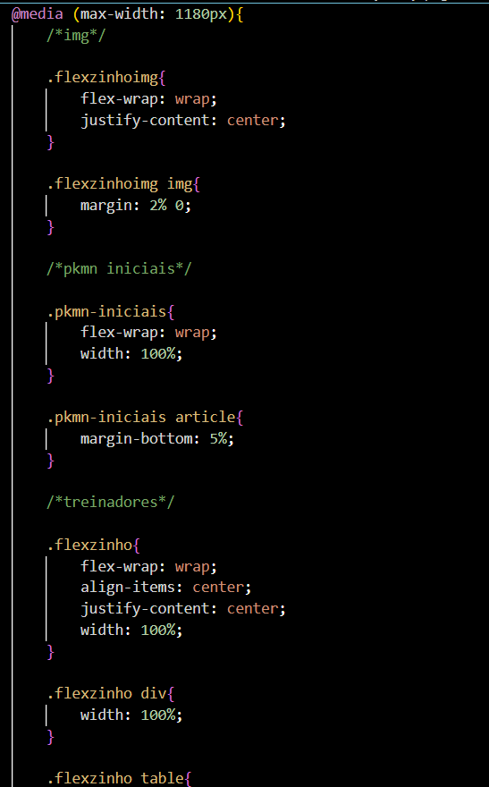
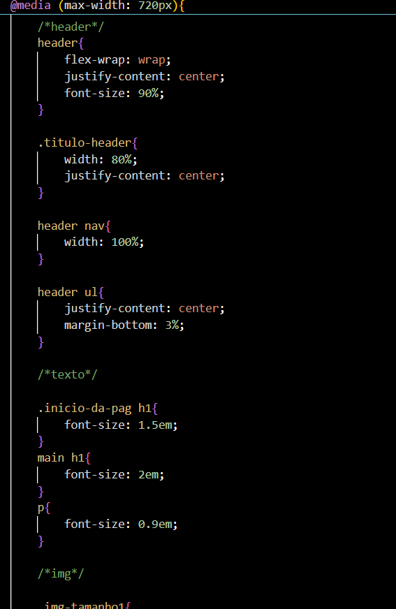
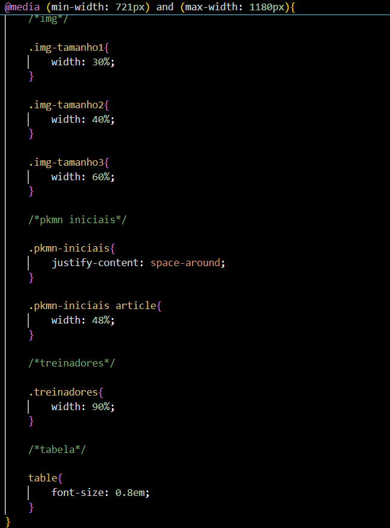
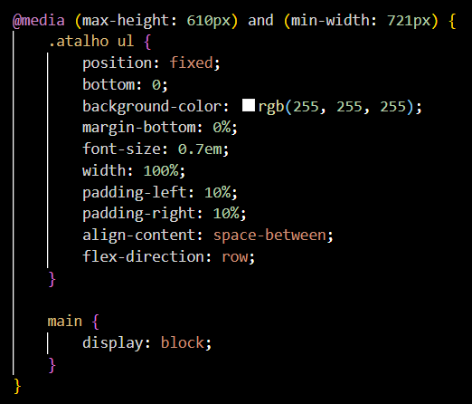
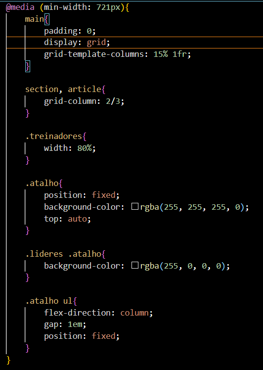
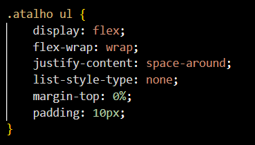

# Kantásticos

## Feito por: Thauan Guilherme de Souza Araújo

_URL do site:_ https://thauanaraujo.github.io/kantasticos-de-kanto/

_Itens opcionais implementados (conforme enunciado):_

- (3-10%) Algo interativo na página utilizando JavaScript / (2-5%) Easter egg usando CSS ou JavaScript:

Botão escondido na frase "Let's go Pikachu", que troca a cor do <code>header</code> para amarelo e o ícone do header para um Pikachu, que, ao clicá-lo, faz o som que o Pikachu dos jogos de Pokémon faz.

- (5-10%) Colocar animações, transições e transformações:

Animação que faz alguns elementos do site aparecerem de baixo para cima ao iniciar/atualizar a página e transition ao passar por cima dos botões dentro de <code>nav</code>.

- (5%) Alguns elementos com posicionamento não estático:

Header e lista com os nomes dos treinadores Pokémon com o <code>position: sticky</code> (<code>position: fixed</code> na lista em dispositivos menores).

- (5%) Exibição de um vídeo sobre o tema:

Vídeos do Youtube incluido para mostrar as aberturas dos jogos na página inicial 

- (5%) Usar o GitHub ao longo do trabalho:

- (5%) Fazer o site todo completamente responsive:

- (3-6%) Usar flexbox e grid:

Flexbox usado no <code>header</code> e na <code>ul</code> com os nomes de treinadores, Grid utilizado no <code>main</code> em layout de dispositvos maiores nas páginas "Líderes" e "Elite dos 4".

_Link para o repositório do site no GitHub:_ https://github.com/ThauanAraujo/kantasticos-de-kanto
